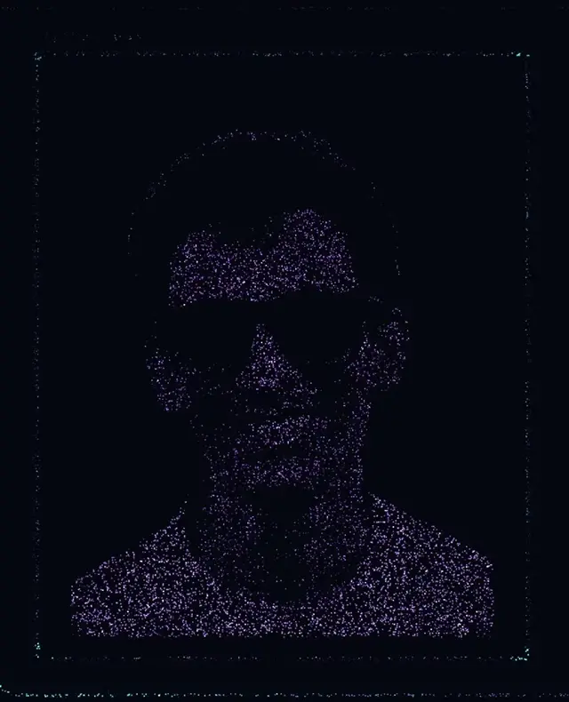
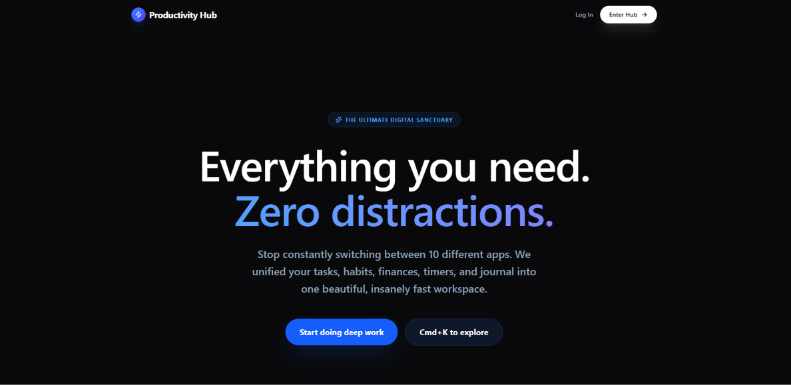
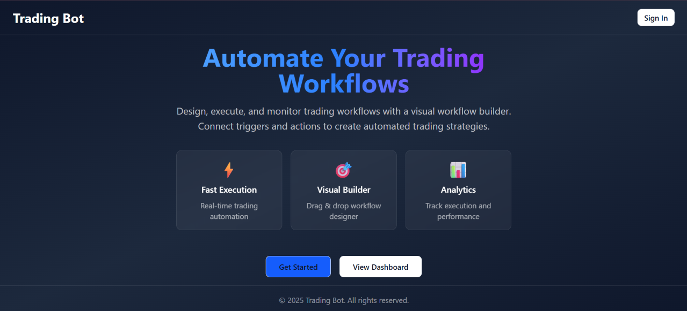
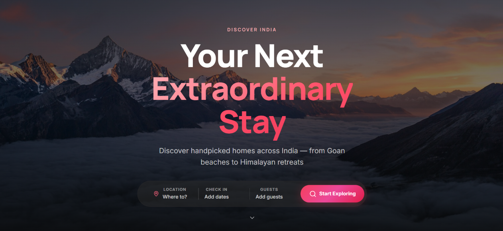

<a href="https://github.com/visheshio">
  
</a>

<div align="center">
  <a href="https://git.io/typing-svg">
    
  </a>
</div>

<br/>

<div align="center">

  
  <a href="https://visheshio.vercel.app/">
    
  </a>
  <a href="https://github.com/visheshio?tab=repositories">
    
  </a>
</div>

<br/>

<div align="center">
  <b>I build fast, polished web apps, from pixel-perfect UIs to the APIs behind them.</b><br/>
  <sub>Currently exploring immersive 3D on the web and AI-driven interfaces.</sub>
</div>

---

## 👨‍💻 About Me

<table>
<tr>
<td width="60%" valign="top">

```typescript
const vishesh = {
  name:              "Vishesh Maheshwari",
  role:              "Full Stack Web Developer",
  location:          "Surat, Gujarat 🇮🇳",
  languages:         ["TypeScript", "JavaScript", "Python"],
  frontend:          ["React", "Next.js", "Vue", "Tailwind CSS"],
  backend:           ["Node.js", "Express"],
  databases:         ["PostgreSQL", "MongoDB"],
  deploy:            ["Vercel", "GitHub Actions"],
  currentlyBuilding: "Immersive 3D web experiences 🌌",
  currentlyLearning: ["Python", "AI-driven UIs"],
  openTo:            ["Collaborations", "Open source", "Interesting problems"],
  motto:             "Code. Ship. Iterate. Repeat. 🚀",
} as const;
```

</td>
<td width="40%" align="center" valign="middle">
  
</td>
</tr>
</table>

---

## 🛠️ Tech Arsenal

<div align="center">

| | |
|:--|:--|
| **Languages** |  |
| **Frontend** |  |
| **Backend** |  |
| **Databases** |  |
| **DevOps** |  |
| **Tools** |  |

</div>

---

## 🚀 Featured Projects

<!-- ✏️ Descriptions and stack badges below are inferred from your repo names.
     Edit them so they match what each project really does. -->

<table>
  <tr>
    <td width="42%" valign="middle">
      <a href="https://build-productivity-hub.vercel.app/">
        
      </a>
    </td>
    <td valign="top">
      <h3>🧠 Productivity Hub</h3>
      <p>An all-in-one workspace to plan tasks, stay focused and keep your day organised.</p>
      <p>
        
        
        
      </p>
      <a href="https://build-productivity-hub.vercel.app/">🔗 Live demo</a> &nbsp;·&nbsp;
      <a href="https://github.com/visheshio/build-productivity-hub">📂 Source</a>
    </td>
  </tr>
  <tr>
    <td width="42%" valign="middle">
      <a href="https://trading-n8n-monorepo.vercel.app/">
        
      </a>
    </td>
    <td valign="top">
      <h3>⚡ Trading Bot</h3>
      <p>A visual, node-based workflow builder for automating trading strategies, structured as a monorepo.</p>
      <p>
        
        
        
      </p>
      <a href="https://trading-n8n-monorepo.vercel.app/">🔗 Live demo</a> &nbsp;·&nbsp;
      <a href="https://github.com/visheshio/trading-bot">📂 Source</a>
    </td>
  </tr>
  <tr>
    <td width="42%" valign="middle">
      <a href="https://advanced-airbnb-clone.vercel.app/">
        
      </a>
    </td>
    <td valign="top">
      <h3>🏡 Advanced Airbnb Clone</h3>
      <p>A full-featured stays marketplace: browse listings, explore details and book your next trip.</p>
      <p>
        
        
        
      </p>
      <a href="https://advanced-airbnb-clone.vercel.app/">🔗 Live demo</a> &nbsp;·&nbsp;
      <a href="https://github.com/visheshio/advanced-airbnb-clone">📂 Source</a>
    </td>
  </tr>
</table>

<div align="center">
  <sub>🎧 Also built: <a href="https://github.com/visheshio/Spotifyclone">Spotify Clone</a> &nbsp;·&nbsp; <a href="https://github.com/visheshio?tab=repositories">See all repositories →</a></sub>
</div>

---

## 📊 GitHub Activity

<div align="center">
  
  
  <br/>
  
  <br/><br/>
  
</div>

### 🐍 Watch My Contributions Get Eaten

<!-- Generated by .github/workflows/snake.yml (runs every 12 hours, output goes to the `output` branch) -->
<div align="center">
  <picture>
    <source media="(prefers-color-scheme: dark)"  srcset="https://raw.githubusercontent.com/visheshio/visheshio/output/github-contribution-grid-snake-dark.svg" />
    <source media="(prefers-color-scheme: light)" srcset="https://raw.githubusercontent.com/visheshio/visheshio/output/github-contribution-grid-snake.svg" />
    
  </picture>
</div>

### 🏆 Trophies

<div align="center">
  <a href="https://github.com/visheshio">
    
  </a>
</div>

---

## 🌐 Let's Connect

<div align="center">
  <a href="https://linkedin.com/in/visheshio"></a>
  <a href="https://twitter.com/Visheshio"></a>
  <a href="mailto:maheshwarivishesh17@gmail.com"></a>
  <a href="https://visheshio.vercel.app/"></a>
  <a href="https://dev.to/visheshio"></a>
  <!-- Discord profile links only work with your numeric user ID:
       https://discord.com/users/YOUR_NUMERIC_ID  -->
  <a href="https://discord.com/users/visheshio"></a>
</div>

<br/>

<div align="center">
  <sub>Got an idea, a bug to squash, or a project to collaborate on? My inbox is open. 📬</sub>
</div>

---

<div align="center">

### ☕ Support My Open Source Work

<a href="https://github.com/sponsors/visheshio">
  
</a>

</div>

---

<!-- ═══════════════  FOOTER  ═══════════════ -->


<div align="center">
  <sub>💡 <em>"First, solve the problem. Then, write the code."</em> — John Johnson</sub>
  <br/><br/>
  <sub>Made with ❤️ and lots of ☕ • © visheshio</sub>
</div>
